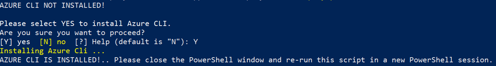
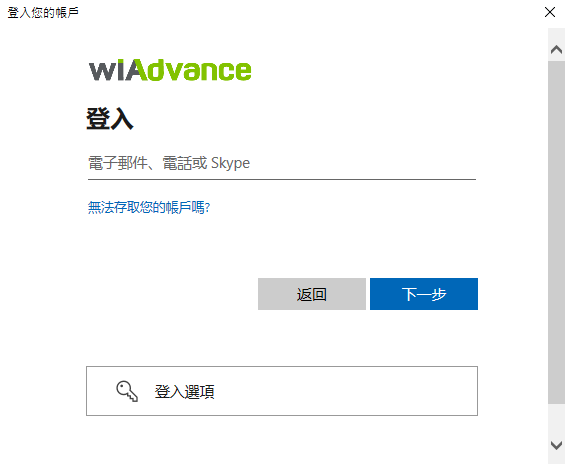

# Prerequisites

Before you begin, please review the information in the README file. The default settings in the repo were selected to enable users to easily set up and try the application. You may need to modify these settings to meet your organization's specific requirements.

You will need:
* An Azure subscription where you can create the following kinds of resources:
    * App service
    * App service plan
    * Bot Service
    * Bot channels registration
    * MySQL
* A copy of the wiabot app GitHub repo

# Powershell deployment

## 1. Deploy to your Azure subscription

  Please follow below steps to deploy app template:

- Download the whole solution folder from GitHub
- Unzip the Content to a folder.
- Open a PowerShell window in **administrator** mode and navigate to the folder where you unzipped the content.
- Navigate to Deployment folder.
    ```  
    cd wiabot\Deployment
    ```
- Run the below command. This will allow you to run deploy.ps1. By default, the execution policy is restricted. You may change it to back restricted after deployment is completed.
    ```
    Set-ExecutionPolicy -ExecutionPolicy RemoteSigned
    ```
- Run the below command to unblock the deployment script.
    ```
    Unblock-File -Path .\deploy.ps1
    ```
---
## 2. Update parameters.json file
- You will find a `parameters.json` file under Deployment folder. Please update all the parameters.

  

- Replace `<<value>>` with appropriate value for all the required fields. Make sure you review the default values for optional fields.
- You may refer to the following:

    - `subscriptionId` - Azure subscription to deploy the solution to (MUST be associated with the Azure AD of the Office 365 tenant that you wish to deploy this solution to.) e.g. 22f602c4-1b8f-46df-8b73-45d7bdfbf58e.
    - `subscriptionTenantId` - Id of the tenant to deploy to (If you are not sure how to get Tenant ID, please check Azure Active Directory in Azure Portal. Under Manage, click Properties. The tenant ID is shown in the Directory ID box). e.g 98f3ece2-3a5a-428b-aa4f-4c41b3f6eef0. Tenant ID is also available in the `Overview` section".
    - `resourceGroupName` - Name for a new resource group to deploy the solution to - the script will create this resource group. e.g. wiabotRG.
    - `location` - Azure region in which to create the resources. The internal name should be used e.g. eastus. Run the following command in Powershell to list internal names.
      ```
      az account list-locations -o table
      ```
    - `appName` - which the template uses to generate names for the other resources.
    - `botId` - The globally unique and immutable bot ID. Also used to configure the displayName of the bot, which is mutable.
    - `botSku`: The pricing tier for the hosting plan. You may choose between F0, S1.
    - `newAppServicePlanName`: The name of the App Service Plan.
    - `newAppServicePlanLocation`: The location of the App Service Plan
    - `newWebAppName`: The globally unique name of the Web App.
    - `mysqlHost`: The connection host name of MySQL Host.
    - `mysqlUsername`: To login MySQL database using a user account.
    - `mysqlPassword`: To login MySQL database using a user password.
    - `mysqllDatabase`: The MySQL Database.
    - `mysqlPort`: The connection host port of MySQL Port.
    - `developerName` - The display name for the developer/company.
    - `websiteUrl` - The https:// URL to you company's website. This link should take users to your company or product-specific landing page.
    - `privacyUrl` - The https:// URL to the company's privacy policy.
    - `termsOfUseUrl` - The https:// URL to the company's terms of use.
    - `appNameShort` - The app name short.
    - `appNameFull`  - The app name full.
    - `appDescriptionShort` - The app description short.
    - `appDescriptionFull` - The app description full.
---

## 3. Execute script

- Open a PowerShell window in **administrator** mode and navigate to Deployment folder
    ```  
    cd wiabot\Deployment
    ```
- Execute the `deploy.ps1` script in the Powershell window:
    ```
    .\deploy.ps1
    ```

- If the Azure CLI is not installed, it will prompt you to confirmation dialog to install azure CLI. Enter `Y` to proceed.

  

>**Note** : Restart the Powershell after Azure CLI is installed. The script will automatically **exit** just after CLI application installation. It will ask you to open a new session and re-run the script.

- If the azure CLI application is already installed, the script will check if the following modules are installed.
  

> Note: The script requires Azure CLI `v.2.2` or later. The script will install Azure CLI if its not already installed. If it is already installed, make sure its `v2.2` or later.

- The script will prompt *twice* for authentication during execution, once to get access to the Azure subscription, and the other to get access to Azure Active Directory. Please login using an account that has **contributor** role or higher.

  

  

- When the script is completed a `DEPLOYMENT SUCCEEDED` message will be displayed and the script will open the folder that contains the app packages (zip files).

  

- The script will finally generate manifest zip file for the application.

  

- After running the script. AD apps, Bot/Config Apps, and all required resources will be created.
- If PowerShell script breaks during deployment, you may run the deployment again if there is no conflict (a resource name already exist in other resource group or another tenant)

---

## 4. Run the app in Microsoft Teams

1.	If your tenant has sideloading apps enabled, you can install your app to a team by following the instructions below.
    * Upload package to a team using the Apps tab: https://docs.microsoft.com/en-us/microsoftteams/platform/concepts/apps/apps-upload#upload-your-package-into-a-team-using-the-apps-tab
    * Upload package to a team using the Store: https://docs.microsoft.com/en-us/microsoftteams/platform/concepts/apps/apps-upload#upload-your-package-into-a-team-or-conversation-using-the-store

2.	You can also upload it to your tenant's app catalog, so that it can be available for everyone in your tenant to install: https://docs.microsoft.com/en-us/microsoftteams/tenant-apps-catalog-teams