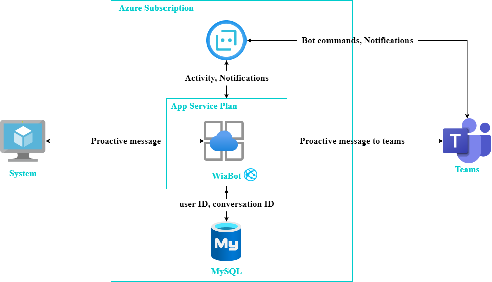

## Teams Bot

The Teams Bot is built using the Bot Framework SDK v3 for NodeJS. If it were to receive request by service api, it is send the message to user on teams. Instead, the bot listens for onMembersAdded events in order to store user ID and conversation ID.

The web app also implements the ProcessNow endpoint. This endpoint, when called with the correct Key, which is aligned between the bot's web app, triggers the bot stored data in database. To do this, the web app fetches the metadata for the teams, fetches the user ID and conversation ID to send proactive messages.
